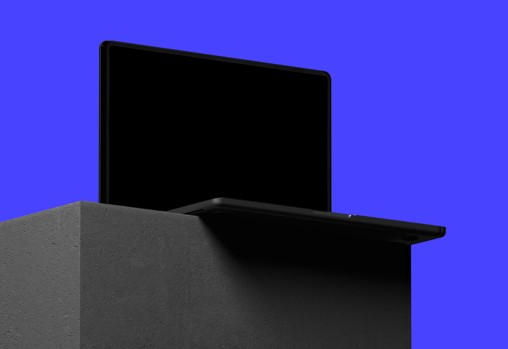

# Chat
...



Dit is de repository van <a href="https://danianmarengo.nl">Danian Marengo</a> zijn, 'chat- room' website. Deze website is gemaakt voor het project <a href="https://github.com/cmda-minor-web/real-time-web-2223">'Real time web' </a>, dat deel uitmaakt van de <a href="https://github.com/cmda-minor-web">Minor Webdesign And Development 2022- 2023</a> aan de <a href="https://www.hva.nl/">Amsterdamse Hogeschool voor de Kunsten</a>, onderdeel van het programma <a href="https://www.hva.nl/opleidingen/communication-and-multimedia-design?gclid=Cj0KCQiAgaGgBhC8ARIsAAAyLfFCp5OTcBLGcx-_uMWa2sowONOebB19jLA1KMt2yEmVFGWaHdsi9DwaAq0PEALw_wcB">Communicatie en Multimedia Design.</a>

<br>

## Beschrijving
...

<br>

## Aan de slag
Je moet Node.js en Node Package Manager op je machine geïnstalleerd hebben, dit zijn onze enige afhankelijkheden om het project lokaal te kunnen draaien.

<br>


```shell
# Kloon de repository.
Git clone https://github.com/Marengd/real-time-web-2223.git

# Navigeer naar de gekloonde projectfolder.
Cd ...

# Installeer de projectafhankelijkheden.
Npm ...

# Start de projectserver.
Npm run start
```
<br>


## Credits
<ul>
  <li></li>
</ul>

<br>

## Miscellaneous
Follow Danian Marengo, <a href="https://www.danianmarengo.nl">Website</a>

<br>

## License
<a href="https://github.com/Marengd/kwoot/blob/main/LICENSE"> Mit</a>
<br>
Written by Danian Marengo